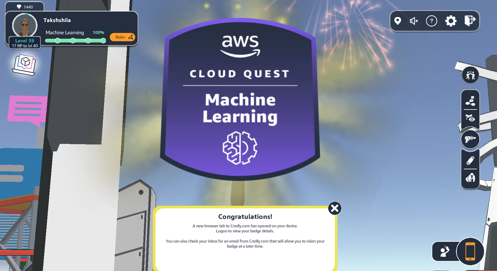

## Machine Learning With AWS Skill Builder CloudQuest

<!--  -->

 

 

Learning Machine Learning Skills through Interactive and Engaging platform ###( AWS Skill Builder CloudQuest). Through this blend of gamified experience, hand-on labs, and interactive tasks, make learners a sense of rewards and opportunity to explore key AWS services like Amazon Sagemaker, Lambda, S3, CloudFront, API Gateway, Amazon Polly, Amazon Transcribe, Amazon Comprehend. 

This challenged-based learning helps understanding the end-to-end machine learning workflow, from data preprocessing to model evaluation and deployement. Click following links to learn more about specific project. 

### [Intro to GenAI](./Intro_to_GenAI/)   

### [Chatbot with LLM](./Chatbots_with_LLM/)   

### [Tic Tac Toe Game](./Reinforcement_Learning_Tic_Tac_Toe/)   

### [Get Home Safe](./Get_Home_Safe/)   

### [Rekognition](./Rekognition/)     

### [Speech to Text](./SpeechToText_transcribe/)

### [Text to Speech](./TextToSpeech/)

### [Documents to Text](./TextFromDocu/)

### [Documents to Text](./TextFromDocu/)

### [Sentiment Analysis: Comprehend](./Comprehend_SentimentAnalysis/)

### [Anomaly Detection ](./Anomaly_Detection/)

### [Image Recognition](./Tensorflow_And_ComputerVision/)

### [Spy Drones Detection](./Spy_Drones_Detection/)

### [Text to Image: Stable Diffusion](./Text_to_Image_Creation_GenAI/)

<!-- 

Learning Machine Learning Skills through Interactive and Engaging platform ###( AWS Skill Builder CloudQuest) 

 -->
